# UAPConnect

**UAPConnect** is a Django-based job/recruitment portal that connects employers and job seekers. Employers can post job adverts, and job seekers can browse listings, apply, and track the status of their applications in real time.

---

## ✨ Features

- **User Authentication** — Register, login, email verification (via one-time code), and secure password reset flow with expiring tokens.
- **Job Advert Management** — Employers can create, publish, and manage job adverts (title, company, employment type, experience level, on-site/remote/hybrid, location, skills, deadline).
- **Job Browsing & Search** — Job seekers can search/filter jobs by keyword and location (covers all 64 districts of Bangladesh).
- **Application Tracking** — Applicants can apply with a CV, portfolio link, and track application status (`APPLIED`, `INTERVIEW`, `REJECTED`).
- **My Jobs / My Applications Dashboards** — Employers see applicants per job; applicants see the status of everything they've applied to.
- **Notifications** — In-app notification badge when an application's status changes.
- **Async Email** — Celery + Redis powered background email sending for verification and status update emails.
- **Admin Panel** — Django admin for managing users, adverts, and applications.
- **Tested** — Unit tests with `pytest`, `pytest-django`, and `factory_boy`.

---

## 🛠️ Tech Stack

| Layer          | Technology                          |
|----------------|--------------------------------------|
| Backend        | Django 5.1                          |
| Task Queue     | Celery 5.4 + Redis (`django-redis`) |
| Task Monitor   | Flower                              |
| Database       | SQLite (development)                |
| Testing        | pytest, pytest-django, factory_boy, Faker |
| Config         | python-decouple (`.env`)            |
| Frontend       | Django Templates, HTML/CSS, JS      |

---

## 📸 Screenshots

| Home | Login | Register |
|:---:|:---:|:---:|
| 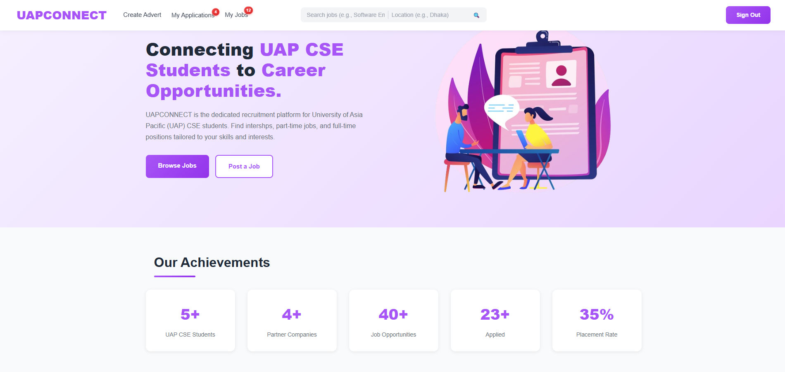 | 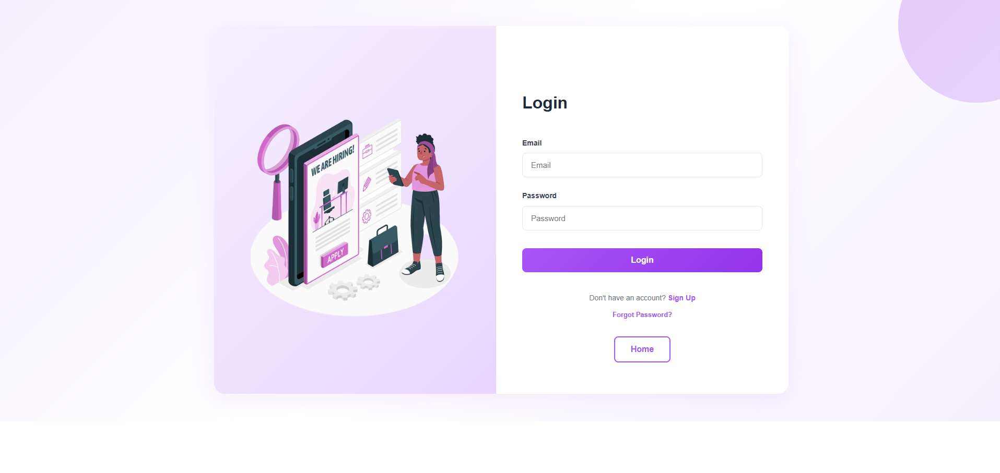 | 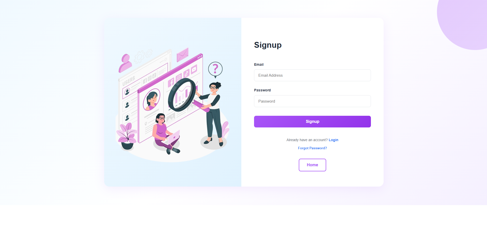 |

| Account Verification | Password Reset | Job Listing |
|:---:|:---:|:---:|
| 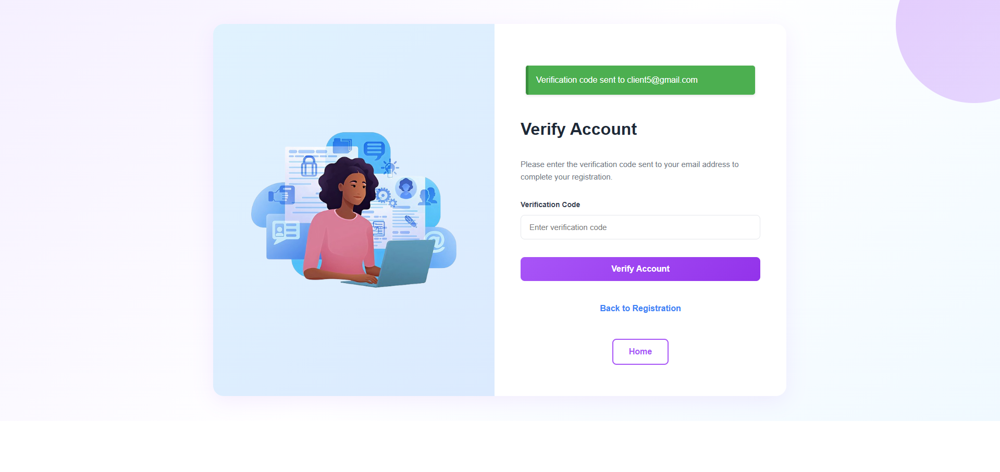 | 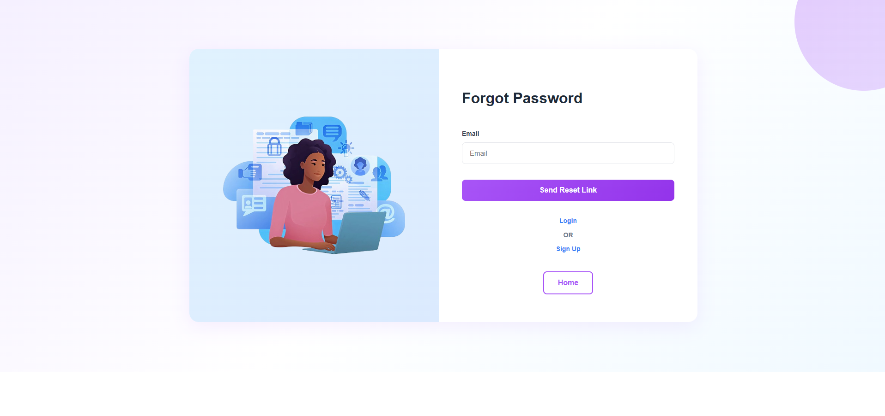 | 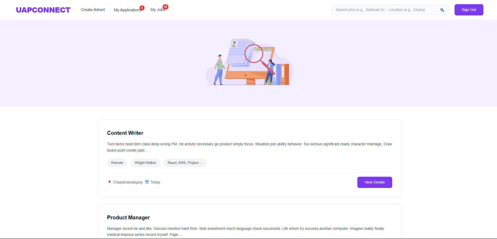 |

| Create Job | My Jobs | Job Status |
|:---:|:---:|:---:|
| 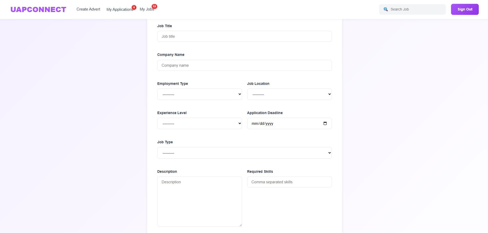 | 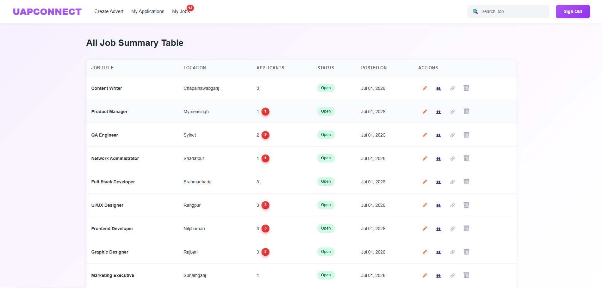 | 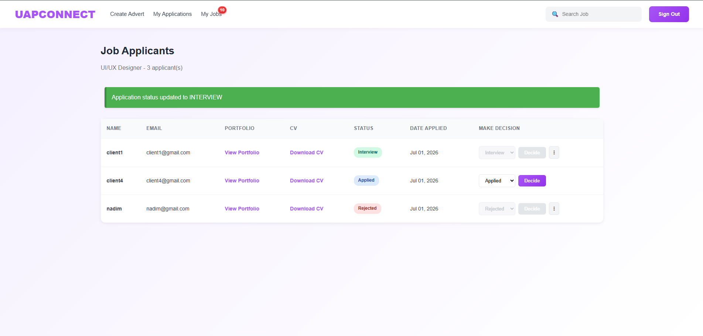 |

| My Applications | My Applications (Detail) |
|:---:|:---:|
| 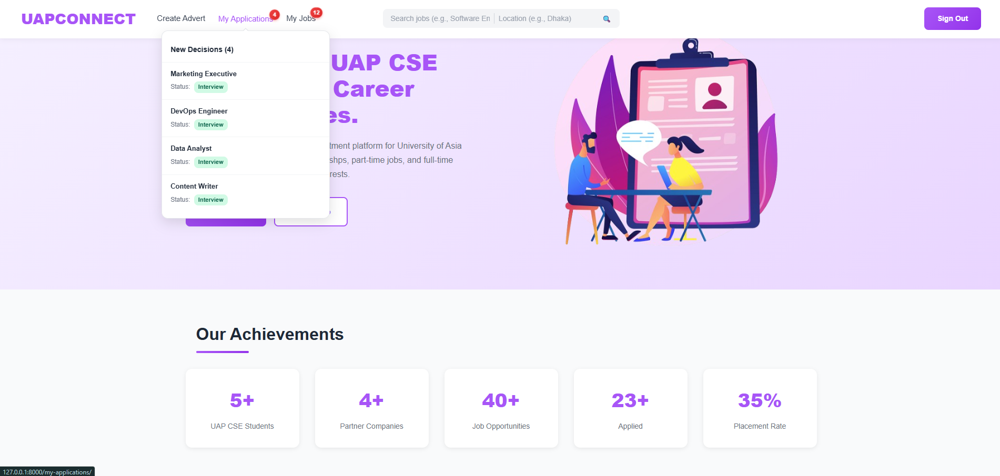 | 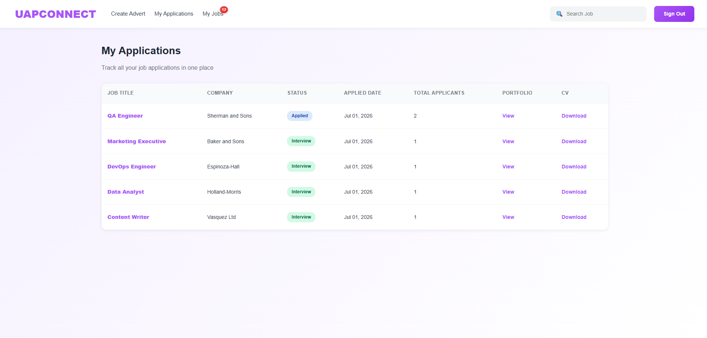 |

---

## 🎨 Design

The UI was designed in Figma before implementation.

**Figma File:** [UAP Connect — Figma Design](https://www.figma.com/design/Cfqq3IYeCS5ej6fjSRCFx2/UAP-Connect?node-id=0-1&t=0mgoW4FYFHu65sA7-1)

| Landing Page | Find Job |
|:---:|:---:|
| 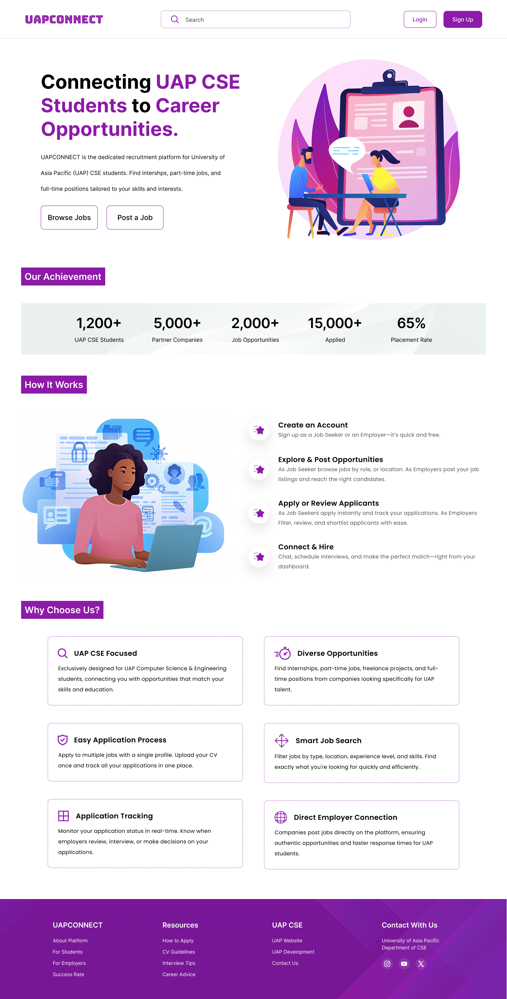 | 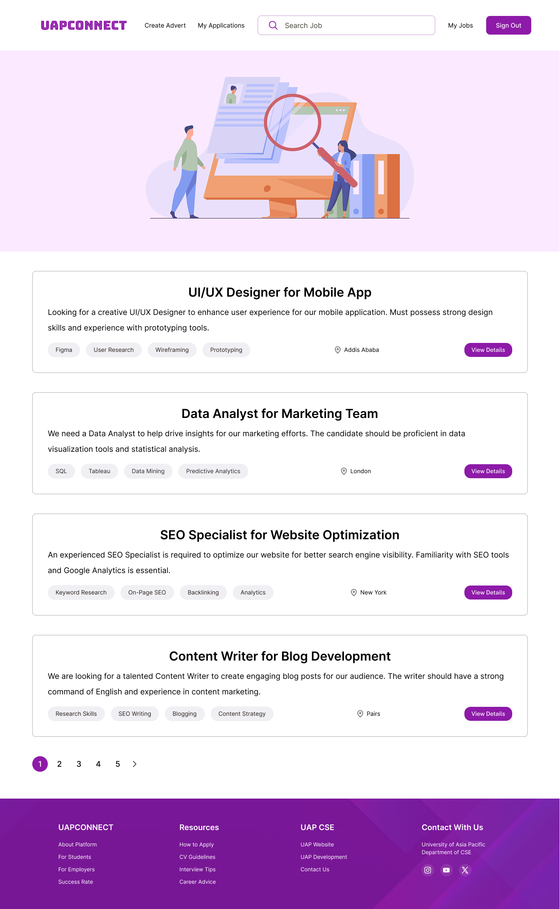 |

| Job Advert | My Jobs |
|:---:|:---:|
| 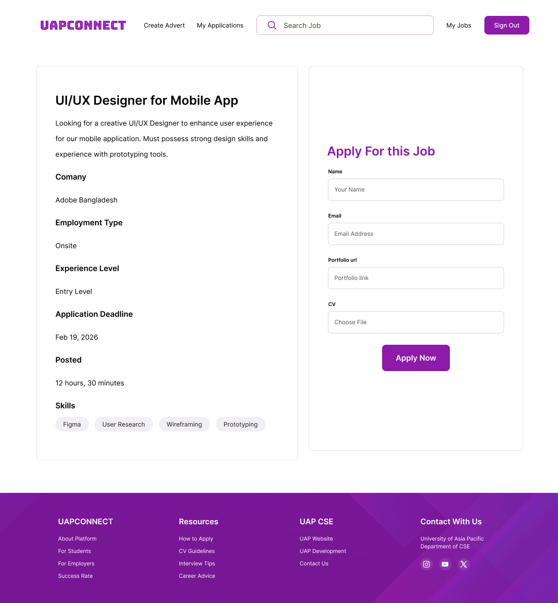 | 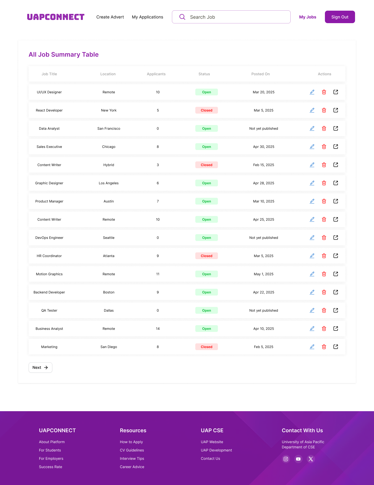 |

---

## 📁 Project Structure

```
UAPConnect/
├── accounts/                  # Authentication app (register, login, verify, reset password)
│   ├── templates/
│   ├── tests/
│   └── migrations/
├── application_tracking/      # Job adverts + applications app
│   ├── templates/
│   ├── management/commands/   # seed_adverts, list_applications, delete_application, delete_test_job
│   └── migrations/
├── common/                    # Shared base models & Celery tasks
├── templates/                 # Global base templates + email templates
├── uap_core/                  # Django project settings, urls, celery config, static files
├── docs/assets/                # Screenshots & Figma design exports
├── manage.py
├── requirements.txt
├── pytest.ini
└── conftest.py
```

---

## 🚀 Getting Started

### 1. Clone the repository

```bash
git clone https://github.com/nhnadim06/UAPConnect.git
cd UAPConnect
```

### 2. Create a virtual environment & install dependencies

```bash
python -m venv venv
source venv/bin/activate   # on Windows: venv\Scripts\activate
pip install -r requirements.txt
```

### 3. Set up environment variables

Create a `.env` file in the project root:

```env
SECRET_KEY=your-django-secret-key
```

### 4. Run migrations

```bash
python manage.py migrate
```

### 5. Start the development server

```bash
python manage.py runserver
```

> **Note:** By default, `EMAIL_BACKEND` is set to Django's console backend. This means account verification codes and password reset links are **not actually emailed** — they are printed directly in the terminal where `runserver` is running. Check the terminal output after signing up or requesting a password reset. To send real emails, configure an SMTP backend (e.g. update `EMAIL_BACKEND` and the SMTP settings in `uap_core/settings.py`).

### 6. (Optional) Start Celery & Redis for async emails

```bash
# Start Redis (must be installed/running locally)
redis-server

# Start the Celery worker
celery -A uap_core worker --loglevel=info

# Start Flower to monitor tasks (optional)
celery -A uap_core flower --port=5555
```

---

## 🧪 Running Tests

```bash
pytest
```

---

## 📄 License

This project is currently unlicensed. Add a license of your choice (MIT, Apache-2.0, etc.) if you plan to open it up for contributions.
